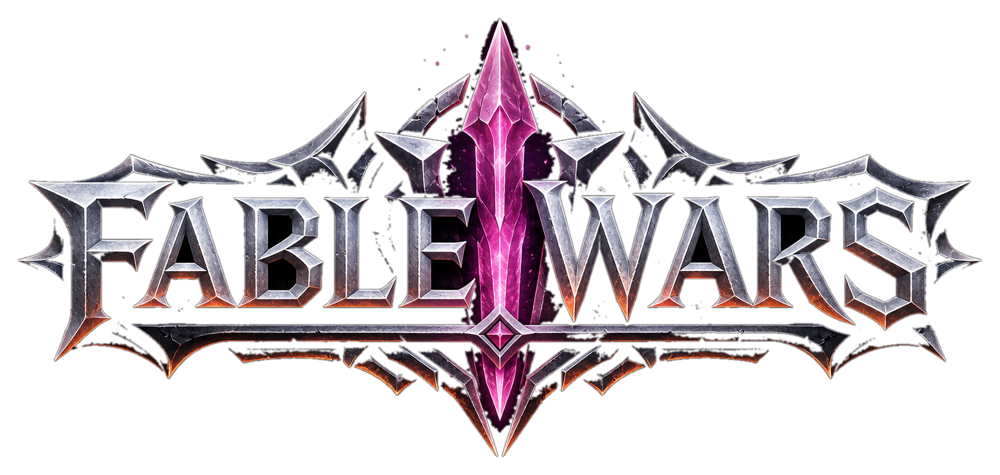
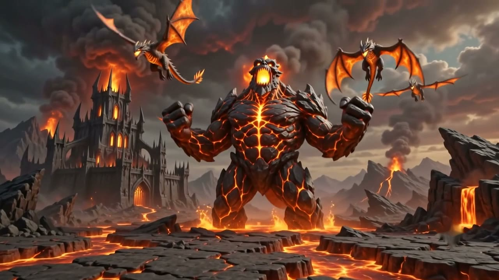
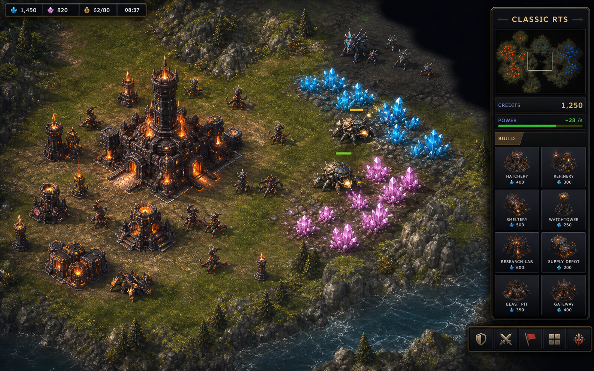
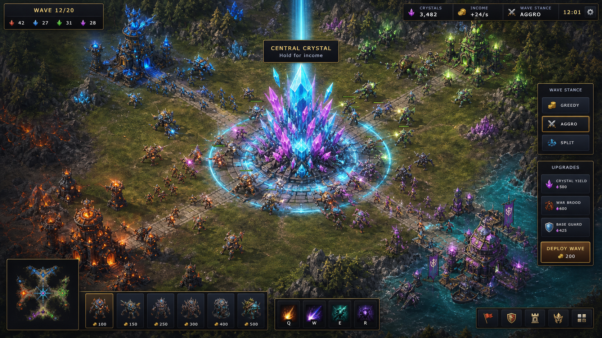
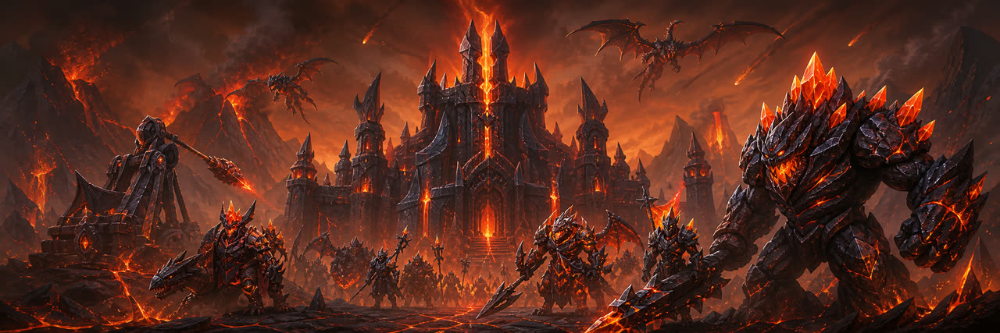
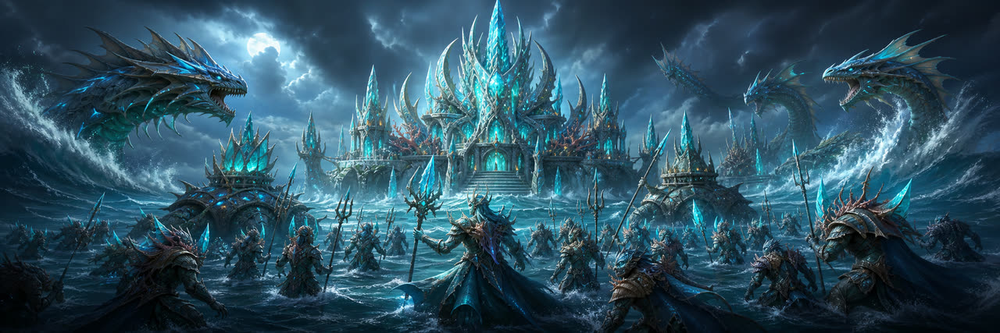
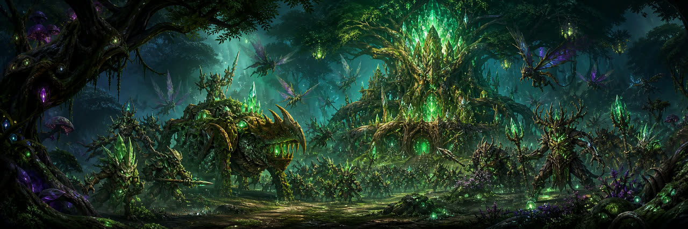
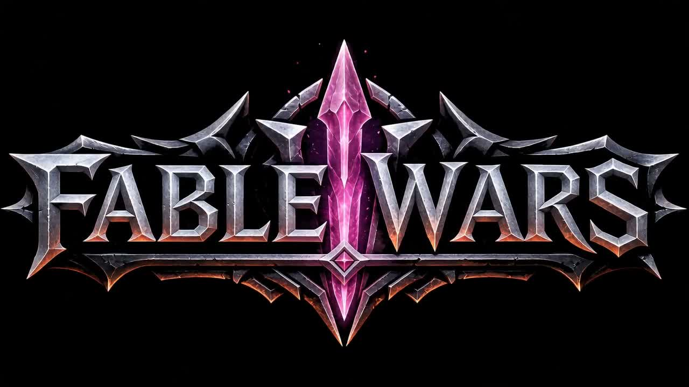

# Fable Wars

<p align="center">
  <a href="https://fablewars.vercel.app/">
    
  </a>
</p>

<p align="center">
  <strong>Harvest crystals. Defend the rift. Crush enemy waves.</strong><br>
  A fantasy browser RTS with base building, crystal economies, cinematic skirmishes, and two playable battle modes.
</p>

<p align="center">
  <a href="https://fablewars.vercel.app/"><strong>Play Fable Wars</strong></a>
  ·
  <a href="https://fablewars.vercel.app/media/fable-wars-cinematic-trailer.mp4">Watch Trailer</a>
  ·
  <a href="https://github.com/twerpygeek/fable-wars">GitHub Repo</a>
  ·
  <a href="https://iangoh.com">Made by iangoh.com</a>
</p>

<p align="center">
  
  
  
</p>

<p align="center">
  <a href="https://fablewars.vercel.app/">
    
  </a>
</p>

## Gameplay

Fable Wars is a fast Canvas 2D real-time strategy game inspired by classic base-building RTS games. Build a
fortified stronghold, harvest volatile crystal fields, command fantasy armies, and fight for control of the
central rift.

| Classic RTS | Crystal Rush Beta |
| --- | --- |
|  |  |
| Build bases, protect harvesters, tech up, and command units directly. | Set battle plans, send waves, hold the central crystal, and break enemy bases. |

## Game Modes

- **Classic RTS:** construction yard, build sidebar, power management, harvesters, tech tiers, defenses, repair/sell, engineers, veterancy, superweapons, fog of war, and direct unit control.
- **Crystal Rush Beta:** a faster lane-push mode where players choose battle plans, claim the central crystal for income, upgrade waves, defend their base, and eliminate enemy citadels.

## Factions

| Scorch Legion | Tide Dominion | Verdant Swarm |
| --- | --- | --- |
|  |  |  |
| Assault, armor, siege. | Control, range, tech. | Swarm, speed, economy. |

## Highlights

- Three asymmetric fantasy factions with a Fire > Grass > Water > Fire damage triangle.
- Land, air, and naval combat with 41 creature units and 45 structures.
- Seeded procedural maps for 2-4 player skirmishes against Easy, Medium, and Hard AI.
- Game-like menu presentation with cinematic trailer, art codex, service record, and battle-code sharing.
- Custom generated art pipeline with GPT Images, Magnific, transparent sprites, terrain packs, and pre-rendered 3D-style objective art.
- Browser-first architecture: TypeScript, Vite, Canvas 2D renderer, deterministic headless simulation.

## Trailer

<p align="center">
  <a href="https://fablewars.vercel.app/media/fable-wars-cinematic-trailer.mp4">
    
  </a>
</p>

## Run Locally

```bash
npm install
npm run dev
```

Then open the local Vite URL and start a skirmish.

## Verification

```bash
npm run typecheck
npm run test:headless
npm run test:crystal-rush
npm run build
```

Useful focused checks:

```bash
npx tsx tests/menuVisuals.ts
npx tsx tests/seoMeta.ts
npx tsx tests/objectiveArt.ts
```

## Architecture

- `src/sim` contains deterministic game simulation, AI, economy, combat, production, fog, and game modes.
- `src/render` contains the Canvas 2D renderer, sprite atlas, terrain cache, effects, minimap, and sprite lab.
- `src/ui` contains menus, HUD, sidebar, input, camera controls, and Crystal Rush panel.
- `public/sprites` contains game-ready unit, building, terrain, and objective override art.
- `docs/art-pipeline` documents the Unreal/GPT Images/Magnific asset pipeline.

See [ARCHITECTURE.md](ARCHITECTURE.md), [DESIGN.md](DESIGN.md), [SPRITES.md](SPRITES.md), and
[docs/art-pipeline/unreal-gpt-images.md](docs/art-pipeline/unreal-gpt-images.md).

## Art And Audio

No copyrighted game assets are used. The shipped visuals, sprite overrides, terrain packs, logo, trailer media,
sound effects, and music are generated or custom-authored for Fable Wars.

## Links

- Play: [fablewars.vercel.app](https://fablewars.vercel.app/)
- Source: [github.com/twerpygeek/fable-wars](https://github.com/twerpygeek/fable-wars)
- Creator: [iangoh.com](https://iangoh.com)
